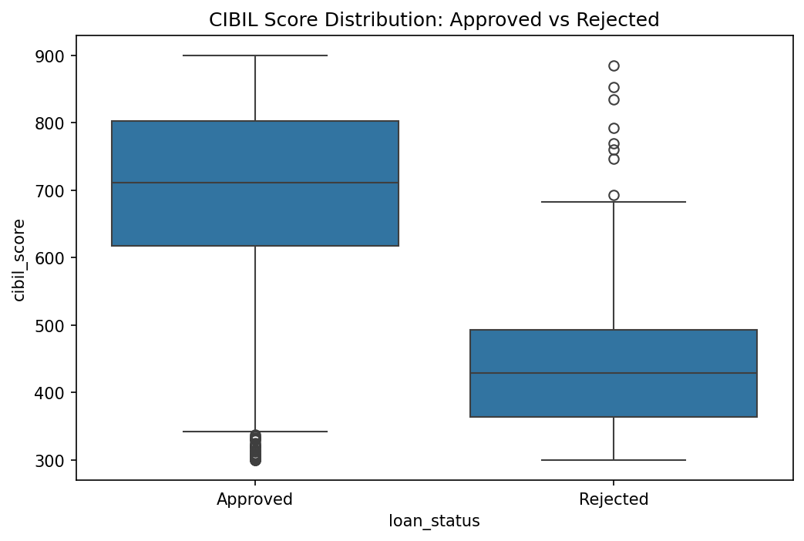
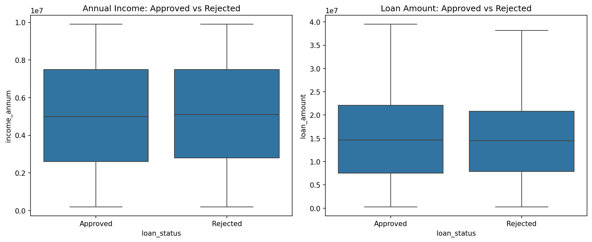

# Loan Approval Disparity Analysis

Risk and fairness analysis on a real loan applicant dataset, investigating which
applicant profiles are approved or rejected, and whether any factors show concerning
approval disparities.

## Business Question

**Which applicant profiles are more likely to be approved or rejected for a loan, and
are there any concerning disparities across financial or demographic segments?**

## Dataset

[Loan Approval Prediction Dataset](https://www.kaggle.com/datasets/architsharma01/loan-approval-prediction-dataset)
(Kaggle) — 4,269 loan applications with financial and demographic details, including
CIBIL (credit) score, income, loan amount, education, employment status, and dependents.

## Tools Used

- **Python** (Pandas) — data cleaning and grouped analysis
- **Matplotlib / Seaborn** — visualizations

## Method

1. Cleaned column names and categorical values (both had inconsistent leading whitespace)
2. Calculated baseline approval rate across all applicants
3. Segmented approval rate by CIBIL score bucket, education, self-employment status, and
   number of dependents
4. Compared average income, loan amount, and CIBIL score between approved and rejected
   groups
5. Visualized the dominant factor (CIBIL score) against two factors that showed no
   meaningful effect (income, loan amount)

## Key Findings

| Factor            | Finding                                                              |
| ----------------- | -------------------------------------------------------------------- |
| CIBIL score       | Dominant factor — 10.7% approval below 500, 99%+ approval above 650 |
| Income            | Nearly identical between approved ($5.03M) and rejected ($5.11M)     |
| Loan amount       | Nearly identical between approved ($15.25M) and rejected ($14.95M)   |
| Education         | No meaningful disparity (62.5% vs 62.0%)                             |
| Self-employment   | No meaningful disparity (62.2% vs 62.2%)                             |
| Dependents (0–5) | No clear trend; approval stayed within a 60–64% band                |

Full write-up and recommendations:
[`reports/business_summary.md`](reports/business_summary.md)

## Visuals

**CIBIL score distribution: approved vs. rejected**


**Income and loan amount: approved vs. rejected (for comparison — no meaningful gap)**


## Project Structure

```
loan-approval-analysis/
├── data/                          # Raw CSV (not included — download from Kaggle link above)
├── notebooks/
│   └── 01_loan_analysis.ipynb
├── reports/
│   ├── business_summary.md
│   ├── chart1_cibil_by_status.png
│   └── chart2_income_loanamount_by_status.png
└── README.md
```

## How to Reproduce

1. Download the dataset from the [Kaggle link above](https://www.kaggle.com/datasets/architsharma01/loan-approval-prediction-dataset)
   and place the CSV in `data/`
2. Install dependencies: `pip install pandas matplotlib seaborn jupyter`
3. Run `notebooks/01_loan_analysis.ipynb` to reproduce the full analysis

## Notable Data Quality Decision

Column names and the `loan_status` values in the raw CSV both contained leading
whitespace (e.g., `' cibil_score'` instead of `'cibil_score'`). This was caught and
cleaned early with `.str.strip()`, since it would otherwise have silently broken column
references and groupby operations later in the analysis.
